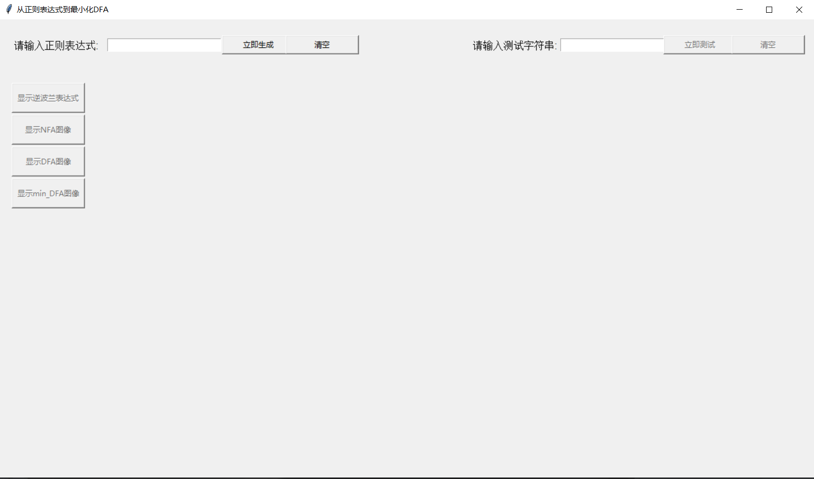
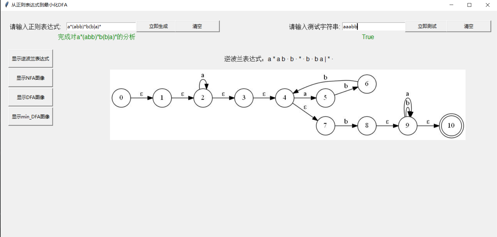

# 运行方式

> *StartConvert.py*为入口文件
> 涉及的库：
>
> + **Tkinter** *(GUI界面)*
> + **PIL**  *(图片格式兼容)*
> + **graphviz** *（生成流程图）*

# 实现思路


## 正则表达式转最小化DFA
### 一、转换步骤

1. 一般正则表达式转完整正则表达式
	
	> + 添加连接符：·
	
	
	
2. 由完整正则表达式生成逆波兰表达式

   > + 使用调度场算法

   

3. 逆波兰表达式到NFA节点矩阵
   > + 分析逆波兰表达式生成NFA节点矩阵
   > + 节点矩阵形如  ``` ['A','B','a']``` 表示由A通过‘a’到B的链接形式  
   >   并且生成终结点的列表：```['B','C',...]```

   

4. NFA节点矩阵到DFA节点矩阵

    > + 把矩阵转化成状态表(形如下表)：
    >
    >   |  I   |  a   |  b   |
    >   | :--: | :--: | :--: |
    >   | 1234 | 1234 |  23  |
    >   |  23  |  23  |  15  |
    >   |  15  |  23  |  15  |
    >
    >   
    >
    > + 将状态集合分类
    > + 分析NFA终结点集合,生成DFA终结点集合
    > + 生成DFA

  

5. DFA节点矩阵到最小化DFA

    > + 将状态表进行归类再编号
    > + 已现有编号生成新表，继续归类编号，直至编号不变
    > + 用最后生成的编号和新表，生成最小化DFA节点矩阵

  

6. 用***Graph viz***将节点矩阵生成图像

   
----------


### 二、图形界面使用

   

   ***只有输入正确的正则表达式，才能进行其余操作***

   

___测试结果直接给出再输入栏下方___

	> 正确为：True，错误为：False

~~所有操作都已显著标明~~


=======================================================
=        ============  ====================  ==========
======  =============  ====================  ==========
=====  ==============  ====================  ======  ==
=====  =====   ======  ==  = ===  ===   ===  =====    =
====  =====  =  ===    ==     ======  =  ==    ====  ==
===  ======     ==  =  ==  =  ==  ===    ==  =  ===  ==
===  ======  =====  =  ==  =  ==  =====  ==  =  ===  ==
==  =======  =  ==  =  ==  =  ==  ==  =  ==  =  ===  ==
=        ===   ====    ==  =  ==  ===   ===  =  ===   =
=======================================================

*Update by      2020年3月26日 23点19分


